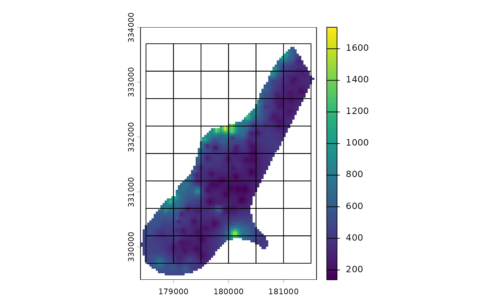
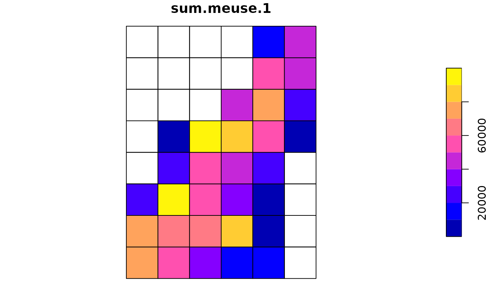
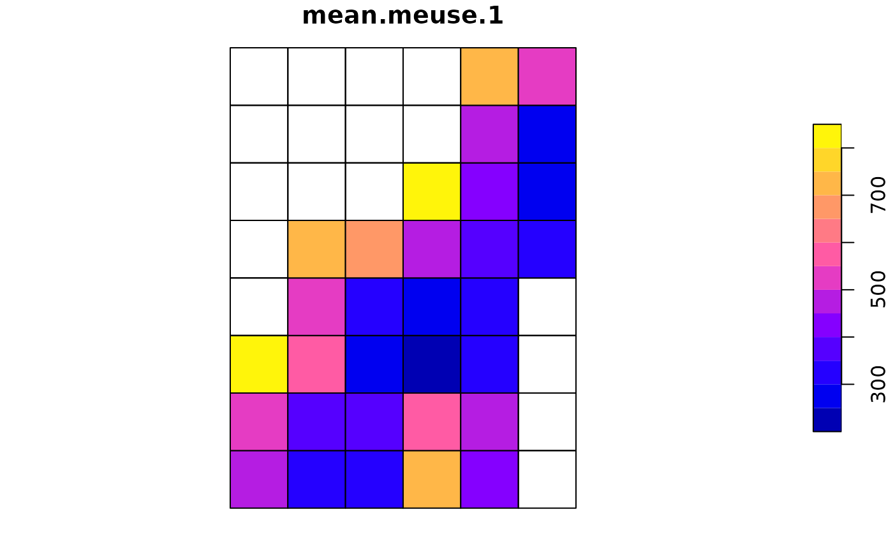

# aggregate-spatial-data

## Introduction

Besides building grids, this package includes functions for aggregating
spatial data. To start, let’s load some packages:

``` r
library(sf)
#> Linking to GEOS 3.12.1, GDAL 3.8.4, PROJ 9.4.0; sf_use_s2() is TRUE
library(terra)
#> terra 1.8.93
library(treeslabgrid)
```

Now let’s get some raster data and throw a grid over it:

``` r
r <- rast(system.file("ex/meuse.tif", package = "terra"))
g <- make_grid_origin_res(
  xy_origin = get_center(r),
  xy_min = get_min(r),
  xy_max = get_max(r),
  cell_size = 500,
  crs = terra::crs(r),
  id_col = "grid_id"
)
```

Note the use of the functions `get_center`, `get_min`, and `get_max` to
get the extent coordinates of objects (`sf` or `terra`).

Now plot, just to make sure the grid makes sense:

``` r
plot(r, reset = FALSE)
plot(st_cast(g[get_geom_colname(g)], "LINESTRING"), add = TRUE)
```



Now we can use this grid to aggregate the data it covers:

``` r
meuse_agg <- aggregate_raster(
  x = r,
  by = NA_character_,
  grid = g,
  grid_id = "grid_id",
  funs = c("sum", "min", "mean", "max"),
  na.rm = TRUE
)
```

Just a note about how the column names are built in the results:

``` r
colnames(meuse_agg)
#>  [1] "grid_id"      "sum.n.1"      "min.n.1"      "mean.n.1"     "max.n.1"     
#>  [6] "max.meuse.1"  "mean.meuse.1" "min.meuse.1"  "sum.meuse.1"  "x"
```

Besides the identifier of each cell in the grid (`grid_id`), we have
columns for the combination of each aggregation function (`funs`), the
input raster (`meuse`), and each category (we didn’t include one in our
example). The names of the column in the results are build in the same
order, separated by points. The exception is `n`, which correspond to
the number of raster cells included in each cell of the aggregation
grid.

Now, we can, for example, plot the total value in each cell of the
aggregation grid:

``` r
plot(meuse_agg["sum.meuse.1"])
```



Or the mean value:

``` r
plot(meuse_agg["mean.meuse.1"])
```


