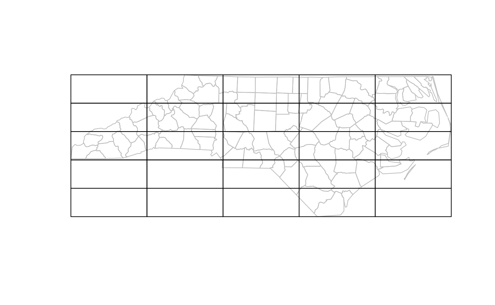
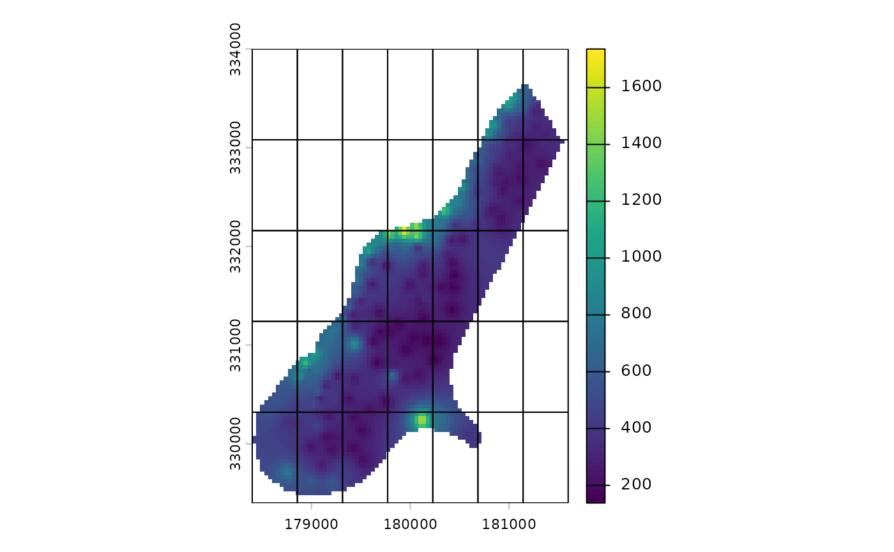
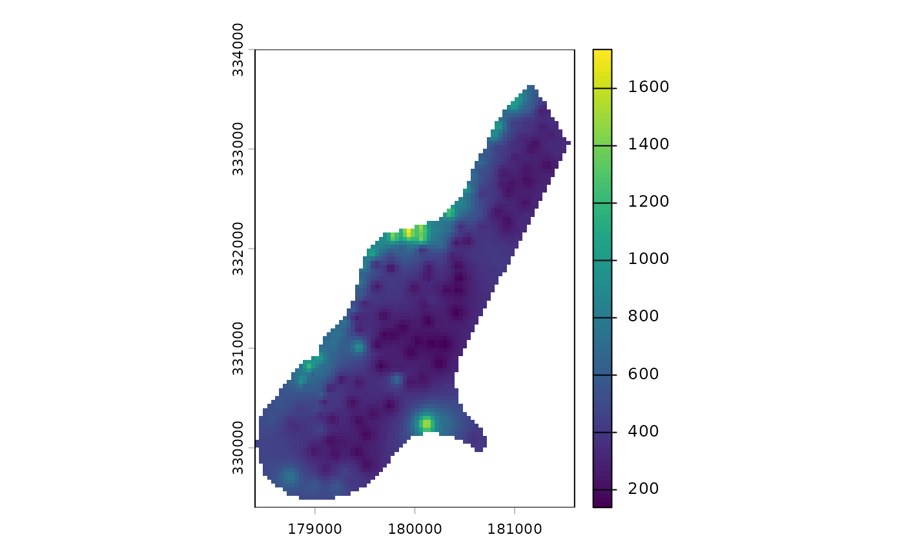

# grids

## Introduction

This package includes functions for building regular vector grids that
can be used to aggregate spatial data. To achieve this, this package
includes extends the function *st_make_grid* provided by the package
*sf*.

To load the package, just type:

``` r
library(treeslabgrid)
```

## Make a grid using geographic data as a template

Imagine we would like to cover a raster with 5x5 grid. We can achieve
this, we first load some data:

``` r
library(sf)
#> Linking to GEOS 3.12.1, GDAL 3.8.4, PROJ 9.4.0; sf_use_s2() is TRUE
library(terra)
#> terra 1.8.93
filename <- system.file("ex/meuse.tif", package = "terra")
r <- rast(filename)
```

Then we call the *make_grid* funcion:

``` r
g <- make_grid(r, n = c(5, 5), cellsize = 1e3)
```

Finally, We could plot the results to ensure they are right:

``` r
plot(r, reset = FALSE)
plot(st_cast(g["geometry"], "LINESTRING"), add = TRUE)
```


The call to *st_cast* converts grid’s cells from polygons into lines,
allowing us to see through them in the plot.

Note that *make_grid* also works with vector data:

``` r
fname <- system.file("shape/nc.shp", package = "sf")
v <- st_read(fname, quiet = TRUE)

g <- make_grid(v, n = c(5, 5))
#> Warning in make_grid(v, n = c(5, 5)): The grid's cells aren't squares!

plot(st_cast(v["geometry"], "MULTILINESTRING"), col = "gray", reset = FALSE)
plot(g["geometry"], add = TRUE)
```



Also note the warning about shape of the cells; since we did not specify
a cell size, the resulting grid was built using rectangles instead of
squares.

## Make a grid using parameters

Alternatively, when we don’t have geographic data to use as a template,
we can create grids using numeric parameters. The following examples
will show how to do that.

### Build grids using coordinates and the number of cells

Imagine that, for some reason, we need to constrain the number of cells
in the grid. In that case, when we only have the minimum and maximum
coordinates, we can use *make_grid_min_max_cells* function.

For example, let us assume we only have the minimum and maximum from the
data showed above and we are limited to 35 cells in the grid.

``` r
min_coords <- ext(r)[c(1, 3)]
max_coords <- ext(r)[c(2, 4)]
center_coords <- min_coords + ((max_coords - min_coords) / 2)
number_of_cells <- c(7, 5)
```

Using these data, we can build a grid:

``` r
g <- make_grid_min_max_cells(
  xy_min = min_coords,
  xy_max = max_coords,
  n = number_of_cells,
  crs = 9001
)
#> Warning in make_grid(x, n = n, id_col = id_col, add_row_col = add_row_col, :
#> The grid's cells aren't squares!
```

We had to add a Coodinate Reference System since by default, the funcion
assumes longitude and latitude and we want our grid in meters.

``` r
plot(r, reset = FALSE)
plot(st_cast(g["geometry"], "LINESTRING"), add = TRUE)
```



### Build grids using origin, distance, and number of cells

In some other ocassions, we could know a point where we want the grid’s
cells to meet; let us call that point an origin. For example, we can use
the top-right corner of our data as an origin point, that is, the
maximum coordinates we computed above.

And use them as an origin point for our grid:

``` r
g <- make_grid_origin_dist(
  xy_origin = max_coords,
  n = number_of_cells,
  cell_size = 500,
  crs = 9001
)
```

Now our grid toches the maximum coordinates of our data and there is
some space remaining in the bottom-left cell.

``` r
plot(r, reset = FALSE)
plot(st_cast(g["geometry"], "LINESTRING"), add = TRUE)
```



## Build grids using origin and resolution

We can use that point as the origin of a grid and, given a cell size, we
can build a grid that goes until the minimum and maximum coordinates.

``` r
g <- make_grid_origin_res(
  xy_origin = center_coords,
  xy_min = min_coords,
  xy_max = max_coords,
  cell_size = 500
)
```

## Cell ids

Each polygon in the grid is identified by an integer.

``` r
g <- make_grid(v,
  n = c(9, 3),
  cellsize = c(1, 1),
  add_centroids = TRUE
)

plot(st_cast(g["geometry"], "LINESTRING"), reset = FALSE)
text(x = g[["X"]], y = g[["Y"]], labels = g[["id"]])
```


It is possible to add identifiers by row and column:

``` r
g <- make_grid(v,
  n = c(9, 3),
  cellsize = c(1, 1),
  add_row_col = TRUE,
  add_centroids = TRUE
)
g["gid"] <- paste(g[["grid_row"]], g[["grid_col"]], sep = ",")

plot(st_cast(g["geometry"], "LINESTRING"), reset = FALSE)
text(x = g[["X"]], y = g[["Y"]], labels = g[["gid"]])
```


