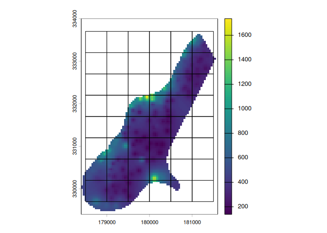
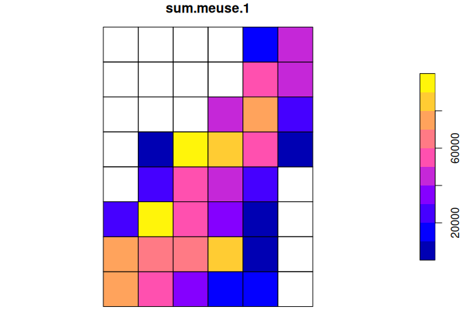
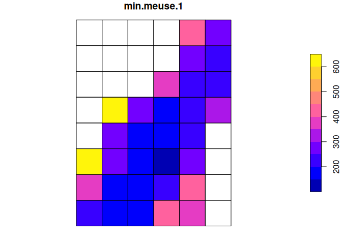
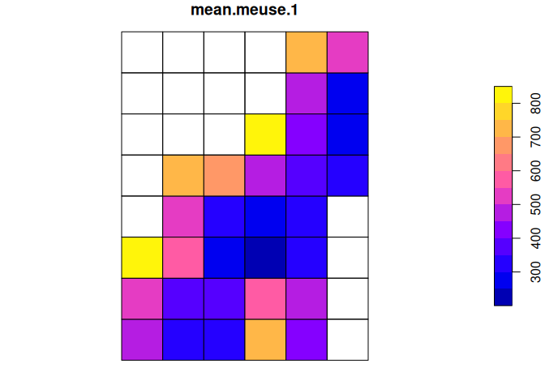
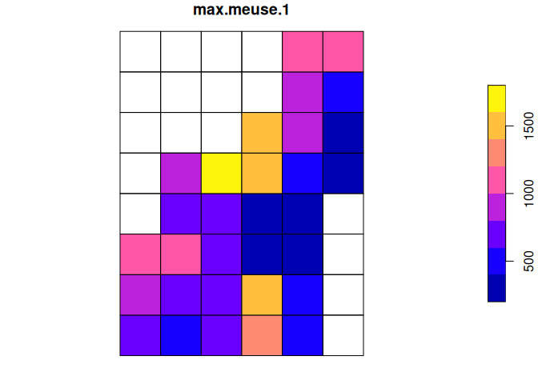

# treeslabgrid

The goal of `treeslabgrid` is to help users to aggregate spatial data
using regular grids. To achieve this, `treeslabgrid` extends the `sf`
and `terra` packages, providing additional functions to create grids and
aggregate data using many aggregation functions simultaneously.

## Installation

You can install the development version of treeslabgrid from
[GitHub](https://github.com/) with:

``` r
# install.packages("pak")
pak::pak("albhasan/treeslabgrid")
```

## Example

This is a basic example which shows you how to create a grid and use it
to aggregate a raster.

First, let’s load some packages:

``` r
library(treeslabgrid)
library(sf)
#> Linking to GEOS 3.13.1, GDAL 3.10.3, PROJ 9.6.0; sf_use_s2() is TRUE
library(terra)
#> terra 1.8.93
```

Now, let’s get a raster from the examples in the `terra` package:

``` r
# Get a raster.
r <- rast(system.file("ex/meuse.tif", package = "terra"))
```

`treeslabgrid` offers many ways to create a grid that covers spatial
data. In our example, we can center our grid in the middle of the
raster’s extent:

``` r
# Create a grid over that covers the raster.
g <- make_grid_origin_res(
  xy_origin = get_center(r),
  xy_min = get_min(r),
  xy_max = get_max(r),
  cell_size = 500,
  crs = terra::crs(r),
  id_col = "grid_id"
)
```

We can plot what we just did:

``` r
plot(r, reset = FALSE)
plot(st_cast(g[get_geom_colname(g)], "LINESTRING"), add = TRUE)
```

 The grid seems
OK; so, we can now aggregate the raster data using it:

``` r
meuse_agg <- aggregate_raster(
  x = r,
  by = NA_character_,
  grid = g,
  grid_id = "grid_id",
  funs = c("sum", "min", "mean", "max"),
  na.rm = TRUE
)
```

Note we use many aggregation functions at the same time, so, the results
present the results for each one:

``` r
plot(meuse_agg["sum.meuse.1"])
```



``` r
plot(meuse_agg["min.meuse.1"])
```



``` r
plot(meuse_agg["mean.meuse.1"])
```



``` r
plot(meuse_agg["max.meuse.1"])
```


